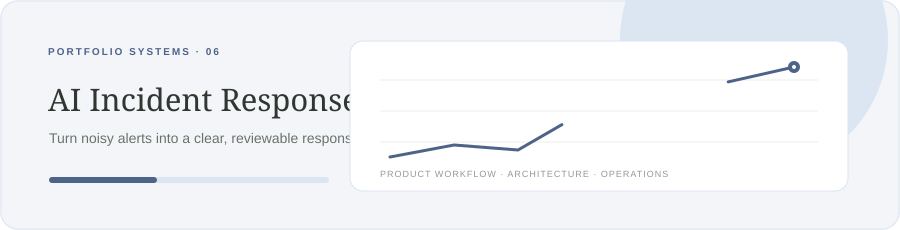

# Beacon — AI Incident Response

**Turn noisy alerts into a clear, reviewable response.**

Java · Spring Boot · Kafka · OpenTelemetry

## Product scope

Correlate alerts and logs, build an evidence-backed incident summary, and propose runbook actions for human approval.

## Architecture notes

Kafka ingestion; deduplicated incident fingerprints; provider-neutral model gateway; explicit approval boundary; append-only audit; OpenTelemetry traces.

### Data model sketch

    incidents(id, fingerprint, severity, status, opened_at) · evidence(id, incident_id, source, observed_at, payload_ref) · action_proposals(id, incident_id, approval_state, result)

## Stack

Java · Spring Boot · Kafka · OpenTelemetry

## Build sequence

1. Alert ingestion and correlation
2. Evidence timeline and incident API
3. Grounded recommendation workflow
4. Approval, audit, and safe runbook adapter

## Current status

Public repository with an animated README. Product code is being built incrementally, one project at a time. This page records the planned product boundary and engineering milestones.

## License

MIT.
